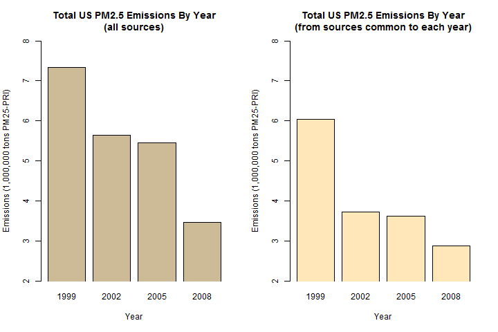
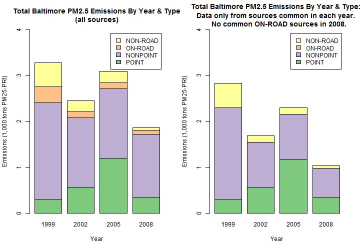
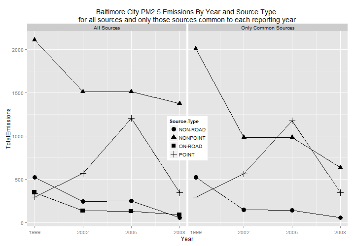
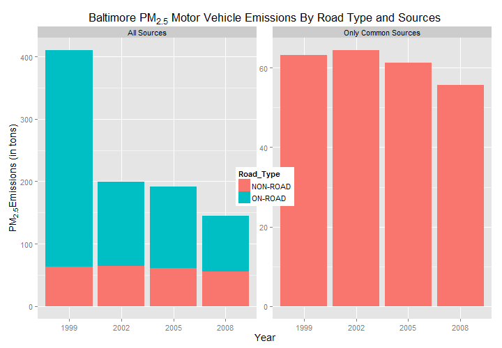
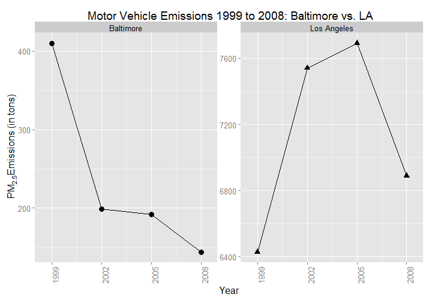

## Contents  
- [Introduction](#id-intro)  
- [Description](#id-description)  
  - [Questions Framing the Inquiry](#id-questions-inquiry)
  - [Missing Values](#id-missing-values)
- [Making Plots](#id-making-plots)  
- [References](#id-refs)

## Introduction
Fine particulate matter (PM2.5) is an ambient air pollutant for which there is strong evidence that it is harmful to human health. In the United States, the Environmental Protection Agency (EPA) is tasked with setting national ambient air quality standards for fine PM and for tracking the emissions of this pollutant into the atmosphere. Approximately every 3 years, the EPA releases its database on emissions of PM2.5. This database is known as the National Emissions Inventory (NEI). You can read more information about the NEI at the <a href="http://www.epa.gov/ttn/chief/eiinformation.html">EPA National Emissions Inventory website</a>. \[[1](#id-refs)\]

This project uses data from the <a href="http://www.epa.gov/ttn/chief/eiinformation.html">EPA National Emissions Inventory website</a>.
In particular, it uses data from the years 1999, 2002, 2005, and 2008.  A copy of this dataset is available in this repo at:  

* <b>Dataset</b>: <a href="https://tbd">Electric power consumption</a> [30Mb]

## Description
The purpose of this project is to get a general sense of of whether particulate matter emissions has improved or not between the years 1999 and 2008.
The following descriptions of the 6 variables in the dataset are as follows:

<ol>
<li><b>fips</b>: A five-digit number (represented as a string) indicating the U.S. county </li>
<li><b>SCC</b>: The name of the source as indicated by a digit string (see source code classification table) </li>
<li><b>Pollutant</b>: A string indicating the pollutant </li>
<li><b>Emissions</b>: Amount of PM2.5 emitted, in tons </li>
<li><b>type</b>: The type of source (point, non-point, on-road, or non-road) </li>
<li><b>year</b>: The year of emissions recorded </li>
</ol>

### Questions Framing the Inquiry
<ol>
<li>Have total emissions from PM2.5 decreased in the United States from 1999 to 2008? Using the base plotting system, make a plot showing the total PM2.5 emission from all sources for each of the years 1999, 2002, 2005, and 2008.</li>
<li>Have total emissions from PM2.5 decreased in the Baltimore City, Maryland (fips == "24510") from 1999 to 2008? Use the base plotting system to make a plot answering this question.</li>
<li>Of the four types of sources indicated by the type (point, nonpoint, onroad, nonroad) variable, which of these four sources have seen decreases in emissions from 1999 - 2008 for Baltimore City? Which have seen increases in emissions from 1999 - 2008? Use the ggplot2 plotting system to make a plot answer this question.</li>
<li>Across the United States, how have emissions from coal combustion-related sources changed from 1999 - 2008?</li>
<li>How have emissions from motor vehicle sources changed from 1999 - 2008 in Baltimore City?</li>
<li>Compare emissions from motor vehicle sources in Baltimore City with emissions from motor vehicle sources in Los Angeles County, California (fips == "06037"). Which city has seen greater changes over time in motor vehicle emissions?</li>
</ol>

### Missing Values
No values appear to missing from the data:
<pre>
NEI <- readRDS("summarySCC_PM25.rds")
any(is.na(NEI))
[1] FALSE
</pre>

## Making Plots

The overall goal of this project is to explore the National Emissions Inventory database and see what it say about fine particulate matter pollution in the United states over the 10-year period 1999 - 2008. 

Each plot was construction and saved as a PNG file.
Separate R code files (plot1.R, plot2.R, etc.) were constructed corresponding to each plot, i.e. code in plot1.R constructs the plot1.png plot. The code file includes the  code for reading the data so that the plot can be fully reproduced.  The code also includes the functionality that creates the PNG files. Each .R file includes only the code for a single plot (i.e. plot1.R produces plot1.png, plot2.R produces plot2.png, etc.).  

Each PNG file prodused by the code is provided in this repository.  The six plots below attempt to answer the six questions listed above: 

### Plot 1
 

### Plot 2
 

### Plot 3
 

### Plot 4
 

### Plot 5
 

### Plot 6
 

## References
[1] Peng, R (2015). "Exploratory Data Analysis" course project at [https://class.coursera.org/exdata-031](https://class.coursera.org/exdata-031)

